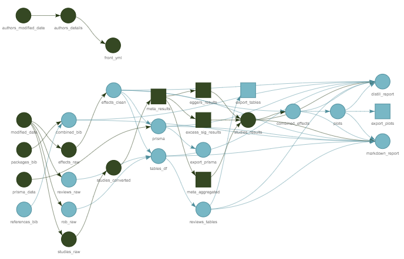

```{r setup, include=FALSE}
options(htmltools.preserve.raw = FALSE)
library(fontawesome)
```

layout: true

<div class="my-footer"><span>tarensanders.github.io/ResBaz2021</span></div>

<!-- this adds the link footer to all slides, depends on my-footer class in css-->

```{r xaringan-logo, echo=FALSE}
xaringanExtra::use_logo(
  image_url = "https://forms.acu.edu.au/__data/assets/file/0020/2330642/ACU_MASTERBRAND_POS_RGB.svg",
  position = xaringanExtra::css_position(top = "1em", right = "1em")
)
```

---
name: xaringan-title
class: left, middle


# How We Do Reproducible Research


.large[Taren Sanders & Philip Parker]

.large[ResBaz Sydney 2021 | `r Sys.Date()`]

<!-- this ends up being the title slide since seal = FALSE-->


---
name: reproducible-research
class: center, inverse, middle

# Reproducible Research

---
name: what

# What Is Reproducible Research?


--
.pull-left[.center[<br>`r fa("database", height = "5em")`]]

--

.pull-right[.center[<br>`r fa("code", height = "5em")`]]

--

<br><br><br><br><br><br><br><br>

.large[.center[Reproducibility ≠ Replicability]]

???

-   Reproducible research boils down to two things:
    
    1. Access to the raw data
    2. Access to the instructions to reproduce the analysis and results
-   Basically could you reproduce your research with exactly the same results? Could someone else?
-   That sounds simple, but there can be a lot to it in practice. This talk is to give some of the lessons we've learned along the way.
-   Don't mix up reproduciblity with replicability. Just because a result is reproducible does not mean it will replicate, but being reproducible is a prerequiste of being replicable.

---
name: why

# Why Do Reproducible Research?

--

## Benefits for...

--

.pull-left[
.center[
.large[Research community]

`r fa("recycle", height = "3em")`
<br><br>
`r fa("hammer", height = "3em")`
<br><br>
`r fa("microscope", height = "3em")`
<br><br>
`r fa("not-equal", height = "3em")`
]]

--

.pull-right[
.center[
.large[You]

`r fa("forward", height = "3em")`
<br><br>
`r fa("history", height = "3em")`
<br><br>
`r fa("thumbs-up", height = "3em")`
<br><br>
`r fa("redo", height = "3em")`

]]

???

### Benefits the research community

-   Other researchers can reuse code, see implementation of methods, find new packages
-   Find mistakes or assess impact of assumptions
-   Necessary for replication
-   An important part of open science
-   Test the impact of your assumptions

### Benefits you

-   Efficiency
-   Track a project history
-   More faith in results
-   Reproducible to you

---
background-image: url(imgs/Spectrum.png)
background-position: 100% 40%

# Reproducibility spectrum

--
.middle-left.large[Anarchy]

--

.middle-right.large[Nirvana]

--

.pull-right.left.large[<br>Us <br>`r fa("arrow-down", height = "1em")`]

???

-   Easy to think of reproducibility as a binary choice
-   But it's more like a spectrum. 
-   Each process gets you just a little bit closer to that mythical nirvana

---
class: center, middle

.large.fancy["Reproducibility is like brushing your teeth. It is good for you, but it takes time and effort. Once you learn it, it becomes a habit"] 


Irakli Loladze

---
class: center, inverse, middle

# `r emo::ji("no_good")` We are not experts

???

-   We're just a couple of scientists who want to do good research
-   Under no illusion that we're great at this
-   Please tell us what we are doing wrong

---
class: center, inverse, middle

# Our Principles

---

# Our Principles

### 1. Readers should be able to access all parts of the process

--

### 2. Integrate everything into a connected workflow

--

### 3. Make changes easy

--

### 4. Never do anything twice

---
class: center, inverse, middle

# What Works For Us

---
# What Works For Us

--

## Register, register, register

--

#### Principles

-   Readers should be able to access all parts of the process

--

<br><br>
.center[]

---

# What Works For Us

--

.left-column[
#### Write in Rmarkdown
]

--

.right-column[
#### Principles

-   Readers should be able to access all parts of the process
-   Integrate everything into a connected workflow
-   Make changes easy
]

---

## Write in Rmarkdown

.center[


]

???

-   In terms of getting started, writing where you code is a great place to start
-   We're talking about R infrastructure, but Python has similar methods (but R is easier). So does Julia (in infancy)
-   Lots of pros: make fewer mistakes, get consistent looking documents, generate individualised reports easily, etc

---
background-image: url(https://raw.githubusercontent.com/rstudio/rmarkdown/main/man/figures/logo.png)
background-position: 85% 10%
background-size: 10%

## Write in RMarkdown

#### Turn this...
```{r eval = FALSE}
The searches yielded `r format(prisma$data$value[1], big.mark=",")` results, 
of which `r format(prisma$data$value[2], big.mark=",")` were duplicates. 
After screening titles and abstracts, we assessed `r format(prisma$data$value[5], 
big.mark=",")` full-texts for inclusion. `r str_to_sentence(numbers_to_words(
prisma$data$value[8], and=TRUE))` met the inclusion criteria and we extracted 
the data of these meta-analyses. Figure \@ref(fig:prisma) presents the full 
results of the selection process.
```

--

#### Into this...

The searches yielded 41,928 results, of which 24,023 were duplicates. After screening titles and abstracts, we assessed 1,964 full-texts for inclusion. One hundred and nineteen met the inclusion criteria and we extracted the data of these meta-analyses. Figure 1 presents the full results of the selection process.

???

-   As a classic example: anyone who has done a review knows how easy it is to mess up the numbers
-   If you tie together your data and code with your writing, it's much easier to make changes without creating mistakes

---
background-image: url(https://raw.githubusercontent.com/rstudio/rmarkdown/main/man/figures/logo.png)
background-position: 85% 10%
background-size: 10%

## Write in Rmarkdown

#### Turn this...
```{r eval = FALSE}
The searches yielded `r format(prisma$data$value[1], big.mark=",")` results, 
of which `r format(prisma$data$value[2], big.mark=",")` were duplicates. 
After screening titles and abstracts, we assessed `r format(prisma$data$value[5], #<<
big.mark=",")` full-texts for inclusion. `r str_to_sentence(numbers_to_words( #<<
prisma$data$value[8], and=TRUE))` met the inclusion criteria and we extracted #<<
the data of these meta-analyses. Figure \@ref(fig:prisma) presents the full 
results of the selection process.
```

#### Into this...

The searches yielded 41,928 results, of which 24,023 were duplicates. .hlight[After screening titles and abstracts, we assessed 1,964 full-texts for inclusion. One hundred and nineteen met the inclusion criteria and we extracted] the data of these meta-analyses. Figure 1 presents the full results of the selection process.

---

# What Works For Us

.left-column[
#### Write in Rmarkdown
#### Store code in GitHub
]

--

.right-column[
#### Principles

-   Readers should be able to access all parts of the process
-   Integrate everything into a connected workflow
-   Make changes easy
]

---
background-image: url(https://github.githubassets.com/images/modules/logos_page/GitHub-Logo.png)
background-position: 80% 10%
background-size: 15%
## Store code in GitHub

### Why?

--

-   Make it public

--

-   Keep it versioned

--

-   Know who to blame

--

-   'Single source of truth'

---

# What Works For Us

.left-column[
#### Write in Rmarkdown
#### Store code in GitHub
#### Use connected storage
]


--

.right-column[
#### Principles

-   Readers should be able to access all parts of the process
-   Integrate everything into a connected workflow
-   Make changes easy
]

---

## Use connected storage

### How do you make sure you always use the latest version of the data?

--

.pull-left[


`r fa("terminal", height = "4em")`

]

--

.pull-right[
<br><br><br>


]

???

-   Sharing data is a big topic, and there are lots of methods of sharing data once a paper is published.
-   This is more about during the development of the project, connecting your code to your data, so that everyone in the team could run it.
-   REDCap is great for rectangular data, or for data capture, but a pain to setup for existing datasets
-   Any data source with an API is great for reproducibility
-   We like Cloudstor for the

    -   Ease of collaboration within/outside our institution
    -   Generous data allowance
-   But the API was clunky and didn't have a good R client - so we built one


---

# What Works For Us

.left-column[
#### Write in Rmarkdown
#### Store code in GitHub
#### Use connected storage
#### Build pipelines with targets
]

--

.right-column[
#### Principles

-   Integrate everything into a connected workflow
-   Make changes easy
-   Never do anything twice

]

---
background-image: url(https://docs.ropensci.org/targets/reference/figures/logo.png)
background-position: 90% 10%
background-size: 10%

## Build pipelines with targets

--

.center[
<br><br><br><br><br>

]

---
background-image: url(https://docs.ropensci.org/targets/reference/figures/logo.png)
background-position: 90% 10%
background-size: 10%

## Build pipelines with targets

.center[
<br>

]

---
background-image: url(https://docs.ropensci.org/targets/reference/figures/logo.png)
background-position: 90% 10%
background-size: 10%

## Build pipelines with targets

.center[
<br>

]


---
background-image: url(https://docs.ropensci.org/targets/reference/figures/logo.png)
background-position: 90% 10%
background-size: 10%

## Build pipelines with targets

.center[

]


---
background-image: url(https://docs.ropensci.org/targets/reference/figures/logo.png)
background-position: 90% 10%
background-size: 10%

## Build pipelines with targets

.center.large[<br><br><br>
> A fully up-to-date `targets` pipeline is tangible evidence that the output aligns with the code and data, which substantiates trust in the results.]

.right[-[The `targets` documentation ](https://docs.ropensci.org/targets/)]


---

# What Works For Us

.left-column[
#### Write in Rmarkdown
#### Store code in GitHub
#### Use connected storage
#### Build pipelines with targets
#### Connect revisions to the changes
]

--

.right-column[
#### Principles

-   Integrate everything into a connected workflow
-   Make changes easy
-   Never do anything twice

]

---

## Connect revisions to the changes

---
background-image: url(imgs/revise_1.jpg)
background-position: 50% 50%
background-size: 90%

## Connect revisions to the changes

#### Step 1: Add a tag to the modified paper...

---
background-image: url(imgs/revise_2.jpg)
background-position: 50% 50%
background-size: 90%

## Connect revisions to the changes

#### Step 2: Call a function inside your revision letter...

---
background-image: url(imgs/revise_3.png)
background-position: 50% 60%
background-size: 80%

## Connect revisions to the changes

#### Step 3: Profit...


---
class: center, inverse, middle

# `r emo::ji("crossed_swords")` Challenges Ahead

---

# `r emo::ji("crossed_swords")` Challenges Ahead

--

1. How to work with `r emo::ji("T-Rex")` dinosaurs (people who don't use `r fa("r-project")`, `r fa("github")`, or `r fa("markdown")`)

--

2. How do we collaborate with each other in real time (*à la* Google Docs)?

--

3. How can we make our processes even more future-proof (e.g., using `r fa("docker")`)?

???

E.g., Phil's problem with upgrading OS.

 
---
name: resources

# Tips & Tricks

--

1. Move collaboration out of email

--

2. Taking a professional mindset

--

3. Reproducibility across projects: make the process repeatable

--

4. Try a retrospective to identify gaps. Build tools to fill the gaps.

--

5. One tweak per week

---

# Reach Us

.pull-left[
.center[## Dr. Taren Sanders


[`r fa(name = "twitter")` @tarensanders](http://twitter.com/tarensanders)  
[`r fa(name = "github")` @tarensanders](http://github.com/tarensanders)  
[`r fa(name = "paper-plane")` Taren.Sanders@acu.edu.au](mailto:taren.sanders@acu.edu.au)
]]

.pull-right[
.center[## Prof. Philip Parker


[`r fa(name = "twitter")` @PhilParker_IPPE](http://twitter.com/PhilParker_IPPE)  
[`r fa(name = "github")` @pdparker](http://github.com/pdparker)  
[`r fa(name = "paper-plane")` Philip.Parker@acu.edu.au](mailto:Philip.Parker@acu.edu.au)
]]
